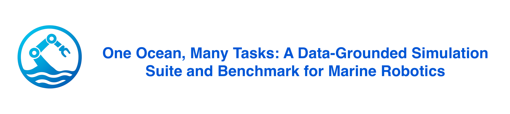

<p align="center">
  
</p>

<a href="https://anonymous-2026.github.io/OneOcean-demo-IROS"></a>
<a href="https://youtu.be/Fz2medRUxwo"></a>
<a href="https://drive.google.com/drive/folders/1EvK_OkdLqaZkPoNPcyibpjaflZ3TATwZ?usp=sharing"></a>
<a href="docs/oneocean_paper.pdf"></a>
<a href="https://zenodo.org/records/18837700"></a>
<a href="https://huggingface.co/datasets/anonymous321123/OneOcean_Environment_Dataset"></a>
<a href="https://holoocean.readthedocs.io/"></a>
<a href="https://marine.copernicus.eu/"></a>
<a href="https://gdal.org/en/stable/drivers/raster/gtiff.html"></a>
<a href="https://www.gebco.net/"></a>

This repository is the cleaned public codebase for the final OneOcean paper submission.
It keeps only the code paths used by the paper:

- `Data_pipeline/`: ocean-environment data pipeline and dataset-variant generation.
- `OCPNet/`: pollution-field and current-aware pollution modeling code.
- `benchmark_core/`: core quantitative benchmark used for the large evaluation tables.
- `tracks/oceangym_benchmark/`: OceanGym and HoloOcean benchmark used for scene-grounded underwater evaluation and media generation.
- `integrations/ros2/`: optional ROS 2 Jazzy bridge for standard robot middleware integration.
- `tests/`: lightweight regression tests for the final benchmark surfaces.

Exploratory branches, deprecated simulators, internal planning notes, and cached run outputs are intentionally excluded from version control.

## Repository layout

```text
OneOcean/
├── Data_pipeline/
├── OCPNet/
├── benchmark_core/
├── integrations/
│   └── ros2/
├── tracks/
│   └── oceangym_benchmark/
├── tests/
├── tools/
├── docs/
└── DATA_PIPELINE_LOG.md
```

## Environment

Base Python dependencies are listed in `requirements.txt`.

Notes:
- The data pipeline requires Copernicus Marine credentials in the environment:
  - `COPERNICUSMARINE_USERNAME`
  - `COPERNICUSMARINE_PASSWORD`
- The OceanGym benchmark requires a working HoloOcean and Ocean package installation. That dependency is managed separately from the base requirements.
- BC training and some local planner backends in `benchmark_core/` require extra ML dependencies such as `torch`.

## Quickstart

### 1. Build the combined environment dataset

```bash
python3 Data_pipeline/run_pipeline.py --overwrite
python3 Data_pipeline/generate_variants.py --which tiny,scene,public --overwrite
```

The pipeline rationale, depth-handling decisions, and reproducibility notes are recorded in `DATA_PIPELINE_LOG.md`.
The public schema, custom-data validation workflow, coordinate convention, and release variants are defined in `docs/DATASET_CONTRACT.md`.

Validate a generated or custom product before exporting it:

```bash
python3 tools/validate_environment_product.py \
  Data_pipeline/Data/Combined/variants/scene/combined/combined_environment.nc \
  --json-out runs/validation/scene.json
```

### 2. Run the benchmark core

Export a drift cache from the combined dataset:

```bash
python3 -m benchmark_core.cli.export_drift_cache \
  --nc Data_pipeline/Data/Combined/variants/scene/combined/combined_environment.nc \
  --u-var utotal \
  --v-var vtotal \
  --time-index 0 \
  --depth-index 0 \
  --out runs/benchmark_core/_cache/drift_scene_t0_d0.npz
```

Run one benchmark episode:

```bash
python3 -m benchmark_core.cli.run \
  --drift-npz runs/benchmark_core/_cache/drift_scene_t0_d0.npz \
  --task go_to_goal_current \
  --difficulty medium \
  --controller go_to_goal \
  --pollution-model gaussian \
  --n-agents 1 \
  --seed 0 \
  --dynamics-model 6dof \
  --constraint-mode hard \
  --bathy-mode hard \
  --validate
```

Run a sweep:

```bash
python3 -m benchmark_core.cli.run_matrix \
  --drift-npz runs/benchmark_core/_cache/drift_scene_t0_d0.npz \
  --preset paper_v1 \
  --dynamics-model 6dof \
  --constraint-mode hard \
  --bathy-mode hard \
  --validate
```

### 3. Run the OceanGym benchmark

Render baseline scene media:

```bash
python3 tracks/oceangym_benchmark/render_scene_media.py \
  --preset ocean_worlds_camera
```

Export a data-grounded current time series:

```bash
python3 tracks/oceangym_benchmark/export_current_series_npz.py \
  --dataset Data_pipeline/Data/Combined/combined_environment.nc \
  --out_npz runs/_cache/data_grounding/currents/cmems_center_uovo.npz
```

Run the OceanGym task suite:

```bash
python3 tracks/oceangym_benchmark/run_task_suite.py \
  --preset ocean_worlds_camera \
  --current_npz runs/_cache/data_grounding/currents/cmems_center_uovo.npz \
  --episodes 3
```

## Documentation

- `Data_pipeline/README.md`: data pipeline usage and dataset assembly details.
- `docs/DATASET_CONTRACT.md`: environment schema, custom-data validation, and NetCDF-to-NPZ round-trip checks.
- `docs/MODEL_SCOPE.md`: implemented dynamics equations, default parameters, pollution probes/sinks, and model limitations.
- `docs/LLM_PLANNER_DIAGNOSTICS.md`: existing-run planner validity, fallback, latency, token, and task-level analysis.
- `benchmark_core/README.md`: quantitative benchmark protocol and CLI usage.
- `tracks/oceangym_benchmark/README.md`: OceanGym benchmark usage, media generation, and external-scene notes.
- `integrations/ros2/README.md`: ROS 2 frame, topic, service, build, and launch contract.
- `docs/`: project and platform website sources.

## Regression test

```bash
python3 -m pytest -q
```
